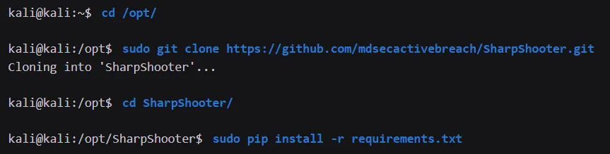
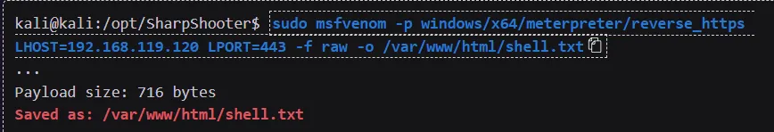
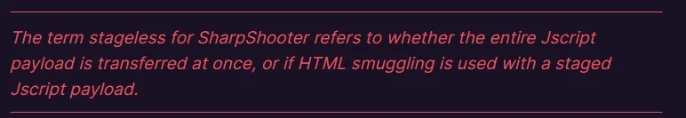
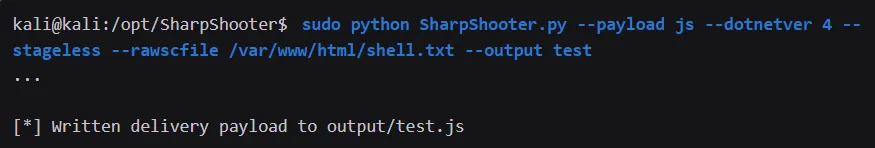

## Using SharpShooter

SharpShooter is a payload creation framework for the retrieval and execution of arbitrary C# source code.

# How to install


# How to use
First, we'll use msfvenom to generate our Meterpreter reverse stager and write the raw output format to a file.


Next, we'll invoke SharpShooter.py while supplying a number of parameters.
```
--payload js ⇒ specify a Jscript output format

--dotnetver ⇒ sets the .NET framework version to target

--stageless parameter ⇒ specifies in-memory execution of the Meterpreter shellcode

--rawscfile ⇒ specifies the file containing our shellcode

--output ⇒ leaving off the file extension
```



Once again we must configure a multi/handler matching the generated Meterpreter shellcode. When that is done, we need to copy the generated test.js file to our Windows 10 victim machine. When we double-click it, we obtain a reverse shell.