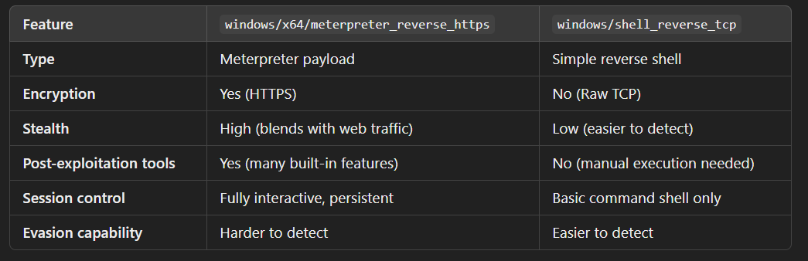
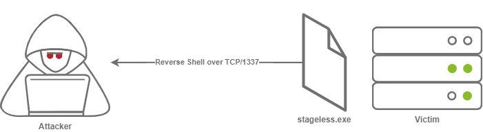
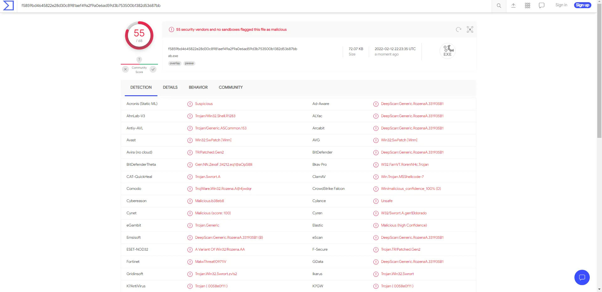
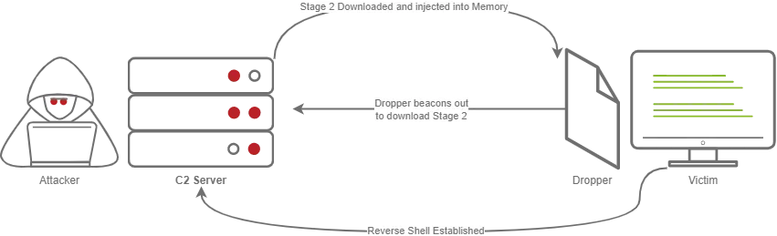
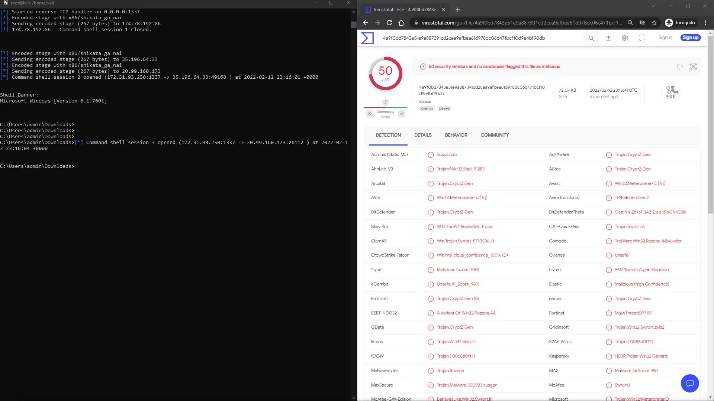

# Using Msfconsole As C2

## Staged vs Non Staged (meterpreter)
```bash
Non-staged payloads
use a _ and staged payloads use / respectively

"windows/x64/meterpreter_reverse_https" ⇒ Connect back to attacker and spawn a
Meterpreter shell

"windows/x64/meterpreter/reverse_https" ⇒ Inject the meterpreter server DLL via the
Reflective Dll Injection payload (staged x64).
```

## Staged vs Non Staged (standard reverse shell)
```bash
"windows/shell_reverse_tcp" ⇒ simple non staged payload

"windows/shell/reverse_tcp" ⇒ staged payload
```

## Key differences between meterpreter shell vs standard reverse shell


## What is a non staged payload?
```
A payload which contains all the code needed to open up a reverse command shell to an attacker's machine
```


```
A stageless payload generated using msfvenom can be detected by virustotal easily
```


## What is a staged payload?
```
A payload which contains a minimal amount of code that performs a callback, then retrieves any remaining code and executes it in the target's memory (the initial executable is typically called a "Dropper" to recieve a second "Stage" payload). 

Sometimes this may just be shellcode, other times it could be a completely seperate module, like Mimikatz. Because of the extra involved interaction, it requires a "Hander". The Metasploit Framework has a module for this called exploit/multi/handler
```


```
A total of 50/69 detections, 5 less (technically 6 if you want to be 100% accurate) than a stageless payload
```


## Advantages of using staged payload
```
- Does not take up as much memory as a non-staged payload
- May evade anti-virus programs
```
